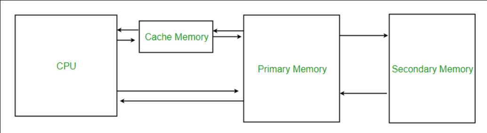
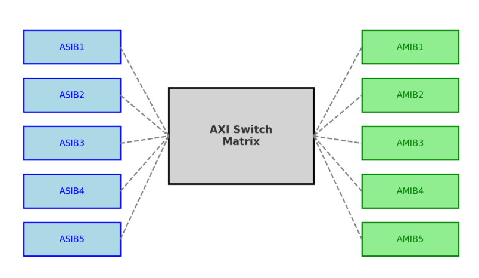

# Dual ARM Cortex Cores
The industrial STM32H745xI/G devices embed two ARM cores, a Cortex-M7 and a Cortex-M4. The Cortex-M4 offers optimal performance for real-time applications while the Cortex-M7 core can execute high-performance tasks in parallel.

The two cores belog to separate power domanins. This allows designing guradual high-power efficiency solutions in combination with the low-power modes already available on all STM32 microcontrollers.

## ARM Cortex-M7 with FPU
The Arm Cortex-M7 with double-precision FPU processor is the latest generation of Arm processors for embedded systems. Delivering outstanding computational performance and low interrupt latency.

The Cortex-M7 processor is a highly efficient high-performance featuring:
- Six-stage dual-issuse pipeline
- Dynamic branch prediction
- Harvard architecture with L1 caches (16 Kbytes of I-cache and 16 Kbytes of D-cache)
- 64-bit ACI interface
- 64-bit ITCM interface
- 2x32-bit DTCM interface

The following memory interfaces anre supported:
- Separete Instruction and Data buses (Harvard Architecture) to optimize CPU latency.
- Tightly Coupled Memory (TCM) interface designed for fast and determisitic SRAM accesses.
- AXI Bus interface to optimize Brust transfers.
- Dedicated low-latency AHB-Lite peripheral bus (AHBP) to connect to peripherals.

The processor supports a set of DSP instructions which allow efficient signal processing and complex algorithm execution.

It also supports single and double precision FPU (floating point unit).

## ARM Cortex-M4 with FPU
The Arm Cortex-M4 processor is a high-performance embedded processor which supports DSP instructions. Delivering outstanding computational performance and low interrupt latency.

The Arm Cortex-M4 processor is a highly efficient MCU featuring:
- 3-stage pipeline with branch prediction
- Harvard architecture
- 32-bit System (S-BUS) interface
- 32-bit I-BUS interface
- 32-bit D-BUS interface

The Arm Cortex-M4 processor also features a dedicated harware adaptiive real-time accelerator (ART Accelerator). This is an instruction cache memory composed of sixty-four 256-bit lines, a 256-bit cachee buffer connected to the 64-bit AXXI interface and 32-bit interface for non-cacheable accesses.

# Topic Questions

## 1. Cache ?

### a. Cache Memory in Computer Organization
Cache memory is a small, high-speed storafe area in a computer. It stores copies of the data from frequently used main memory locations. There are various independent caches in a CPU, which store instructions and data.

- The most impoertant use cache memory is that it is used to reduce the average time to access data from main memory.
- The concept of cache works because there exists locality of reference (the same items or nearby items are more likely to be accessed next) in processes.

By storing this information closer to the CPU, cache memory helps speed up the overall processing time. Cache memory is much faster than the main memory (RAM). When the CPU needs data, it first checks the cache. If the data is there, the CPU can access it quickly. If not, it must fetch the data from the slower main memory.

### b. Characteristics of Cache Memory
- Extremely fast memory type that acts as a buffer between RAM and the CPU.
- Holds frequently requested data and instructions, ensuring that they are immendiately available to the CPU when needed.
- Constlier than main memory or disk memory but more economical than CPU registers.
- Used to speed up processing and synchronize with the high-speed (CPU)




### c. Levels of Memory
#### Level 1 or Register:
It is type of memory in which data is stored and accepted that are immediately stored in the CPU. The most commonly used register is Accumulator, Program counter, Address register etc.

#### Level 2 or Cache Memory:
It is the fastest memory that has faster access time where data is temporarily stored for faster access.

#### Level 3 or Main Memory:
It is the memory on which the computer works currently. It is small in size and once power is off data no longer stays in this memory.


#### Level 4 or Secondary Memory: 
It is external memory that is not as fast as the main memory but data stays permanently in this memory.

### d. Advantages
- Cache Memory is faster in comparison to mian memory and secondary memory.
- Programs stored by Cache Memory can be executed in less time.
- The data access time of Cache Memory is less than that of main memory.
- Cache Memory stored data and insturctions that are regularly used by the CPU, therefore it increases the performance of the CPU.

### e. Disadvantages
- Cache Memory is costlier than primary memory and secondary memory.
- Data is stored on temporary basis in Cache Memory.
- Whenever the system turned off, data and instructions stored in cache memory get destroyed.
- The high cost of cache memory increases the price of the Computer System.

### Look at Lab-1

## 2. AXI ?

### a. Overview
The AXI (advaced extensible interface) interconnect is based on the ARM CoreLink NIC-400 Network Interconnect.

Its main feature are:
- 64-bit AXI bus switch matrix with seven AMBA Slave Interface Blocks (ASIBs) and seven AMBA Master Interface Blocks (AMIBs), in D1 domain.
- Concurrent connectivity of multiple ASIBs to multiple AMIBs
- Programmable traffic priority management to ensure the quality of service (QoS)
- Software-configurable via GPV

### b. Block Diagram
The ASIBs are connected to the AMIBs via AXI switch matrix. Each ASIB is a slave on an AXI or AHB bus (advanced high-performance bus). Similary, each aMIB is a master on an AXI or AHB bus. Where an ASIB or an AMIB is connected to an AHB bus, it converts between the AHB bus and the AXI bus protocol.

The AXI interconnect includes a global programmer view (GPV) which contains register for configuring a few parameters, such as the quality of service (QoS) level at each ASIB.

### c. From The Net
In the STM32H7 series, the **AXI inerconnect** is a high-speed interconnection structure that organizes data exchange between the microcontroller's different cores, memory blocks, and peripheral units.

More technically:

**1. Master and Slave Ports:**
- ASIBs (AMBA Slave Interfaca Blocks): Initiator ports, typically processors or units such as DMA that send data. Each ADIB can operate cas a slave on the AXI or AHB bus.
- AMIBs (AMBA Master Interface Blocks): Target ports, typically memory or peripheral units. Each AMIB can operate as master on the AXI or AHB bus.

**2. AXI Switch Matrix:**
The switch matrix connecting the ASIBs to the AMIBs manages simultaneous data traffic between multiple masters and slaves.

**3. Protocol Conversion:**
- If an ASIB or AMIB is connected to the AHB bus, it performs protocol conversion between AXI and AHB.

**4. Quality of Service and Priority Management:**
- Within the AXI interconnect, a **GPV (Global Programmer View)** is available. Through this, parameters such as QoS level can be configured via software, allowing certain data paths to be prioritized.

**5. Default Slave:**
- Accesses made to unallocated address regions are handled by the default slave, preventing the initiator master or ASIB from being blocked.

In short: The AXI interconnect in the STM32H7 is a central bridge and traffic manager that links high-speed data buses and ensures concurrent and reliable data transfer.



- Left blue boxes → **ASIBs** (initiator/master ports)
- Center gray box → **AXI Switch Matrix** (traffic manager)
- Right green boxes → **AMIBs** (target/slave ports)

In other words, data flows along the path **ASIB → AXI Switch → AMIB.**

In AXI/AMBA terminology, there are the concepts of **"intiator" (master/origibator)** and **"targer (slave/receiver).**

- **Initiator (master):** The endpoint that initiates a transaction (e.g. CPU, DMA).
- **Target (slave):** The endpoint that responds to a transaction (e.g. SRAM, Flash, peripheral).

#### ASIB (AMBA Slave Interface Block)
Although it is called a **“slave”**, in reality it serves as an entry point to the AXI interconnect — meaning it is defined as an **initiator port**. Through this, masters such as the CPU or DMA connect to the interconnect.

#### AMIB (AMBA Master Interface Block)
Although it is called a **“master”**, it actually serves as an exit point of the AXI interconnect — meaning it is defined as a **target port**. Through this, memories or peripheral units are accessed.


### d. APB vs AXI ?
#### 1. What is APB ?
- **APB (Advanced Peripheral Bus)** -> The simplest and slowest bus in the AMBA architecture.
- Design is lightweight, low-power, and has low hardware cost.
- Typically, low-speed peripherals such as UART, GPIO, I2C, SPI and Timers operate over this bus.
- Characteristics:
    - Unidirectional, simple address/command phase -> followed by data transfer.
    - No support for brust (consecutive block) transfer
    - Typically used for peripherals that require low bandwidtgh.

#### 2. What is AXI ?
- **AXI (Advanced Extensible Interface)** -> The evolved, high-performance version of AHB.
- It used high-speed like the STM32H7, especially to support multi-master & multi-slave configurations.
- Characteristics:
    - **Pipeline Support:** Address and daha phase proceed in paralle -> very fast.
    - **Brust Transfer:** Multi data blocks transferred in a single transaction.
    - **Out-of-order Transactions:** Operations can complate in different order, avoiding blocking.
    - Advanced traffic management: QoS, priority management, and parallel access.
    - Suitable for memories requiring high bandwidth, such as DDR, SRAM, and Flash.

#### 3. What is AHB ?
- **AHB (Advanced High-Performance Bus)** -> A bus operating at medium speed within the AMBA architecture.
- In the STM32 family, it usually servers as the main system bus.
- It is not as advanced as AXI but is much faster than APB.
- Characteristics:
    - 32/64-bit data bus, supports brust transfers.
    - Typically used for connecting DMA, memory, and high-speed peripherals.


```text
        +-------------------+
        |   Cortex-M7 CPU   |
        +-------------------+
                |
               (AXI)
                |
     +-----------------------+
     |   AXI Interconnect    |
     +-----------------------+
        |               |
      (AHB)           (AXI direct to RAM/Flash/SDRAM)
        |
   +-----------+-----------+
   |                       |
(AHB Bus)             (APB Bridge)
   |                       |
High-speed             Low-speed
peripherals            peripherals
(DMA, ETH, USB)        (UART, GPIO, I2C, TIM)


```

## 3. What is Burst Transfer ?
A Burst transfer is a method of transferring multiple consecutive data words to memory or a peripheral in a single command (as a block).

In other words:
- **Normally:** Each read/write requires a separete address and control signal.
- **In a burst transfer:** The starting address is given once, then the addres is incremented automatically, and the data flows consecutively.

### Advantages
- **Speed:** The address phase is not repeated -> the address is send only once, and the remaining data flows in a "streaming" manner.
- **Efficiency:**  Less traffic on the memory controller and the bus.
- **High throughput for large data blocks:** Image, audio, DMA transfer ...

### Ehere is it used in STM32 ?
- **DMA:** Large block data (e.g. ADC buffer, UART Rx Buffer, SDMMC, RMC-SDRAM)
- **AXI/AHB Bus:** Memory transfer, CPU cache accesses.
- **SDRAM/Flash:** Fast sequential access.
- **LCD/TFT (LTDC), Camera (DCMI):** Sequential data streams that require high bandwidth.

### Summary

Burst transfer = *"give the address once, then move sequential block data continuously."* It is especially critical in high-speed buses like AXI because it allows maximum utilization of available bandwidth.

## 4. TCM, ITCM, DTCM ?

### What is TCM (Tightly Coupled Memory) ?
- It is different from Normal RAM. It is memory type that is very close to the core, with low latency and deterministic (predictable) behavior.
- It other words, you won't face "miss" issues that occur with cache-based memory accesses.
- İf you say, "My code/data is very critical and must always be accessed in a single cycle." TCM is used.

### What is ITCM (Instruction Tightly Coupled Memory) ? 
- A dedicated TCM for **instructions** -> meaning **code memory**
- You place the critical parts of the program here (e.g. SR – interrupt service routines, control algorithms, motor drive loops)
- The Core fetches intructions from the ITCM directly in a single cycle, without using the cache.
- Much faster and more predictable compared to fetching code from Flash.
- For example: If an interrupt run evey 10 us in a motor control loop, you place the code in the ITCM -> it executes at the **same speed every time,** with no jitter.

### What is DTCM (Data Tightly Coupled Memory) ?
- A dedicated TCM for **Data** -> In other words, memory where critical variables are stored.
- Instead of regular SRAM, it operates like specific register blocks -> accessed by the core's load/store units in a single cycle.
- For example: the latest values from the ADC, PID control parameters, or DSP buffers — variables that are accessed very frequently — are stored in the DTCM.
- If they were in normal SRAM, the cache would come into play — sometimes giving single-cycle access, sometimes taking a few cycles. In the DTCM, this fluctuation doesn’t exist.

### Difference from normal SRAM

| Feature                      | Normal SRAM                | TCM (ITCM / DTCM)                       |
| ---------------------------- | -------------------------- | --------------------------------------- |
| Access speed                 | Cache-dependent → variable | **Fixed, deterministic (single cycle)** |
| Location                     | Through bus matrix         | Directly connected to the core          |
| Usage                        | General purpose            | Critical code and data                  |
| Jitter (latency fluctuation) | Present                    | Absent                                  |


## 5. What is AHB-Lite ?

