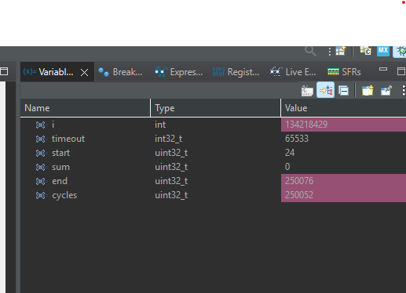
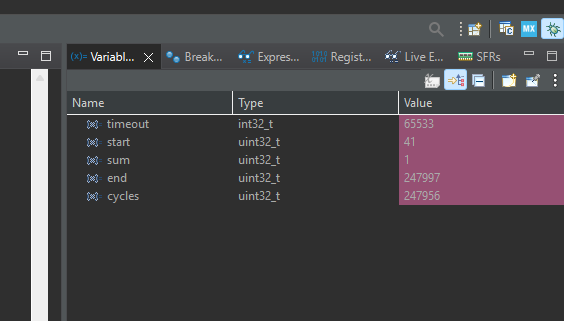
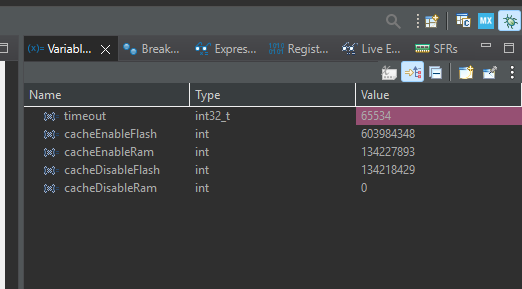
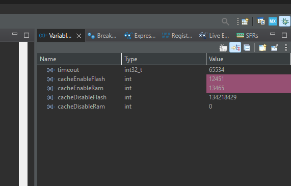
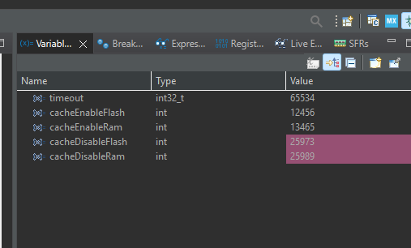

# Test 1
## 1. Purpose
Observing how many cycles it take to read data from RAM.
```
#define SIZE 10000

// Flash da saklanan veri
const uint32_t flash_array[SIZE] = {1};

// RAM de saklanan veri
uint32_t ram_array[SIZE];

// DWT cycle counter init
void DWT_Init(void) {
    CoreDebug->DEMCR |= CoreDebug_DEMCR_TRCENA_Msk; // DWT enable
    DWT->CYCCNT = 0;                                // reset counter
    DWT->CTRL |= DWT_CTRL_CYCCNTENA_Msk;            // start counter
}


int main(void){
    DWT_Init();

    uint32_t start = DWT_GetCycles();


    uint32_t sum = 0;

    // RAM den okuma
    for (int i = 0; i < SIZE; i++) {
         sum += ram_array[i];
    }
    uint32_t end = DWT_GetCycles();

    uint32_t cycles = end - start;
}
```



# Test 2
## 1. Purpose
Observing how many cycles it take to read data from FLASH.
```
#define SIZE 10000

// Flash da saklanan veri
const uint32_t flash_array[SIZE] = {1};

// RAM de saklanan veri
uint32_t ram_array[SIZE];

// DWT cycle counter init
void DWT_Init(void) {
    CoreDebug->DEMCR |= CoreDebug_DEMCR_TRCENA_Msk; // DWT enable
    DWT->CYCCNT = 0;                                // reset counter
    DWT->CTRL |= DWT_CTRL_CYCCNTENA_Msk;            // start counter
}


int main(void){
    DWT_Init();

    uint32_t start = DWT_GetCycles();


    uint32_t sum = 0;

    // FLASH’tan okuma
    for (int i = 0; i < SIZE; i++) {
	    sum += flash_array[i];
    }
    uint32_t end = DWT_GetCycles();

    uint32_t cycles = end - start;
}
```




# Test 3

```
#define SIZE 1024

// Flash da saklanan veri
const uint32_t flash_array[SIZE] = {1,2,3,4};

// RAM de saklanan veri
uint32_t ram_array[SIZE] = {1,2,3,4};

// DWT cycle counter init
void DWT_Init(void) {
    CoreDebug->DEMCR |= CoreDebug_DEMCR_TRCENA_Msk; // DWT enable
    DWT->CYCCNT = 0;                                // reset counter
    DWT->CTRL |= DWT_CTRL_CYCCNTENA_Msk;            // start counter
}
uint32_t measure_flash(void) {
    volatile uint32_t sum = 0;
    uint32_t start = DWT->CYCCNT;
    for (int i = 0; i < SIZE; i++) {
        sum += flash_array[i];
    }
    uint32_t end = DWT->CYCCNT;
    return end - start;
}

uint32_t measure_ram(void) {
    volatile uint32_t sum = 0;
    uint32_t start = DWT->CYCCNT;
    for (int i = 0; i < SIZE; i++) {
        sum += ram_array[i];
    }
    uint32_t end = DWT->CYCCNT;
    return end - start;
}

void Cache_Disable(void) {
    SCB_DisableICache();
    SCB_DisableDCache();
}

void Cache_Enable(void) {
    SCB_EnableICache();
    SCB_EnableDCache();
}

int main(void){
    DWT_Init();


    Cache_Enable();
    int cacheEnableFlash = measure_flash();
    int cacheEnableRam =measure_ram();


    Cache_Disable();
    int cacheDisableFlash = measure_flash();
    int cacheDisableRam =measure_ram();
}
```





