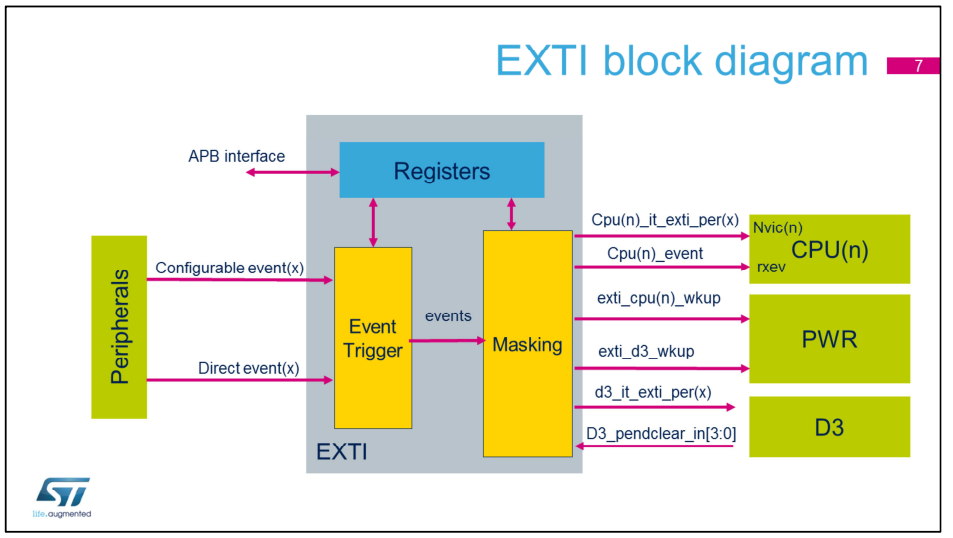

# NVIC
## 1. Overview
For STM32H7 microcontrollers, both CPU1 (Cortex M7) and CPU2 (Cortex M4) cores have their own nested vector interrupt controller (repectivetly NVIC1 and NVIC2), which include the following features;
-  Up to 150 maskable interrupt channels,
-  16 programmable priority levels,
-  Low-latency exceptipn and interrupt handling,
-  Power management control,
-  Implementation of system control register.

## 2. Key Features
The NVIC provides a fast response to interrupt requests, allowing an application to quickly serve incoming events. Most of the peripherals have a unique interrupt vector. The interrupt vector table can also be relocated.

## 3. Exception Entry and Return
The NVIC provides several features for efficient hangling of exception.

When an interrupt is served and a new request with high priority arrives, the new exception van preempt the current one. This is called **nested exception handling.** The previous exception hanfler resumes exception after the higher priority exception is handled.

When an interrupt arrives, the processor first the program context before executing the interrupt hangler. If the processor is performing this contex-saving operation when an interrupt of higher priority arrives, the processor switch directly to hangling the higher-priority interrupt when it is finished saving the program context.

When all of the exception hanflers have been run and no other exception is pending, the processor restores the provious context from the stack and returns to normal application execution.

## 4. Notes
Nesten vector interrupt controller (NVIC) is a method of prioritizing interrupt, improving the MCU's performance and reducing interrupt latency. 

NVIC provides implementation schemes for handling interrupts that occur wher other interrupts are being executed or when the CPU is in the process of restoring its previous state and resuming its suspended process.

# EXTI

## 1. Overview
The EXTI controller provides up to 89 independent events, split in to categories;
- Configurable events,
- Direct events

The EXTI controller can be configured to wakeup CPU1, CPU2 or both independently. It can  also be used to wakeup only the D3 Domain for autonomous operation.
Applications benefit through smarter use of low-power modes, taking advantage of the capability to wake up via external communication or requests.

## 2. Key Features
The EXTI controller provides interrupt and event generation functions, as well as the capability to wake up the processors and the D3 domain from Stop modes. Configurable events allow the user to select which active edge generates an interrupt or events, with a dedicated status flag for each line. Requests on configurable lines can also be generated by software.

Direct events provide on interrupt or event from peripherals having a status flag requring to be cleared. For direct events that are part of the D3 domain and which have a pending mask and status register, an interrupt may be generated.

EXTI wakeup events may be configured to wakeup a CPU or the D3 domain. Configurable events need to be cleared by the corresponding CPU which has been awaken. The D3 domain wakeup events must be cleared by the D3 domain.

## 3. D3 Autonomous Mode
Some peripherals are able to wakeup the D3 domain Autonomous mode, where both CPUs remain in CStop mode.
In this mode, the D3 domain is able to transfer data between communication peripherals and memory using the BDMA and DMAMUX2. The BDMA trigger is esed to clear the D3 autonomous mode wakeup events and re-enter low- power mode.

The timers can be used to wakeup the D3 domain Autonomous mode on regular basis, i.e. to perform polling tasks.

In addition, timers can be used to clear the D3 autonomous mode wakeup event and re-enter low power mode.

## 4. EXTI Block Diagram

As shown in this figure, the EXTI consists of a register block accessed via an APB interface, an event input trigger block, and a masking block. The register block contains all EXTI registers. The event input trigger block provides event input edge triggering logic. The masking block provides the event input distribution to the different wakeup, interrupt and event outputs, and their masking. 