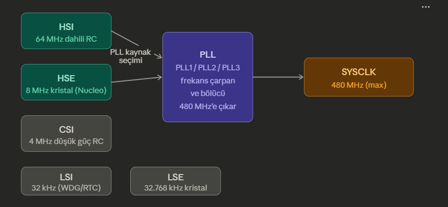

## CubeMX RCC Ayarları

## RCC Nedir?

RCC, STM32'nin tüm çevresel birimlerine ve işlemci çekirdeklerine saat (Clock) sinyali değıtan bloktur. CubeMX'de yanış yapılandırılmış bir RCC, timerların yanlış frekans üretmesi, UART bound rate hatası veya ACI/AAHB/APB bus'larına bağlı periferallerin düzgün çalışmaması gibi sonuçlara yol açar.


## STM32H755'in Saat Kaynakları

Önce H755'teki fiziksel saat kaynakları;




## CubeMX RCC Sekmesindeki Ayarlar

CubeMX'te Pinout&Configuration -> System Core -> RCC altında şu seçimler yapılır;

- **High Speed Clock (HSE):** Nucleo-H755ZI-Q kartında kristal bulunur ancak varsayılan konfigurasyonda kullanılmaz. ST-Link, MCO çıkışından OSC_IN pinine 8 MHz kare dakga sinyali verir. Bu yüzden; **HSE = Bypass Clock Source**. Crystal/Ceremic Resonator seçilirse OSC_OUT da sürülmeye çalışılır, karşısında aktif kristal olmadığından saat başlamaz veya kararsız kalır.

- **Low Speed Clock (LSE):** RTC veya IWDG kullanılacaksa 32.768 kHz kristal için **Crystal/Ceremic Resonator seçilir**. Kullanılmayacaksa **Disable** bırakılır.


## Clock Configuration Sekmesi

PLL hesabı şu formülle yapılır;
````
f_VCO = HSE * (N/M)
f_SYSCLK = f_VCO / P
````

Nucleo-H755 için standart 480 Mhz konfigürasyonu;

| Parametre | Değer     | Açıklama                  |
|-----------|-----------|---------------------------|
| HSE       | 8 MHz     | ST-Link MCO sinyal        |
| /M        | 4         | Giriş bölücü -> 2 MHz     |
| *N        | 240       | VCO çarpanı -> 480 MHz    |
| /P        | 1         | SYSCLK bölücü -> 480 MHz  |

- VCO frekansı 192 MHz - 836 MHz arasında olmalıdır. 2 * 240 = 480 MHz, limit içindedir.

- Bus bölücüleri;

| Bus           | Frekans   | Bölücü            |
|---------------|-----------|-------------------|
| SYSCLK        | 480 MHz   | /1                |
| HCLK/AXI      | 240 MHz   | /2 (D1CPRE)       |
| APB1/2/3      | 120 MHz   | /2 (PPRE)         |
| CM4 (HCLK3)   | 240 MHz   | ayrı ayarlanır    |


- Adım adım yapılacaklar;
    1. PLL Source Mux -> HSE seç
    2. PLL1: M = 4, N = 20, P = 1
    3. System Clock Mux = PLLCLK
    4. D1CPRE = /1 -> SYSCLK = 480 MHz
    5. HPRE = /2 -> HCLK = 240 MHz
    6. D2PPRE1, D2PPRE2, D3PPRE = /2 -> APB'ler 120 MHz
    7. CubeMX hataları kırmızıyla gösterir - tüm kutular temizlenene kadar düzenle.